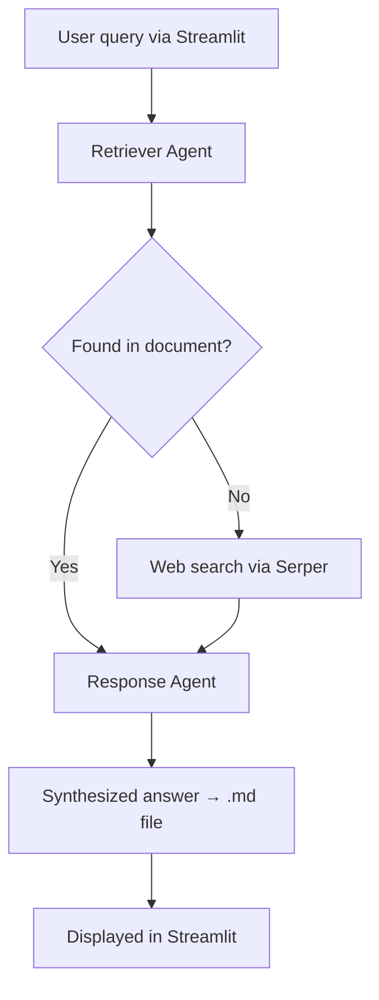

#  Agentic RAG

An **agentic Retrieval-Augmented Generation** system built with [CrewAI](https://www.crewai.com/). Instead of a single retrieval step, a small crew of agents collaborates to answer your questions: one agent retrieves the most relevant information — searching your documents first and falling back to the web when needed — and a second agent synthesizes that information into a clear, written answer.

Runs fully locally with [Ollama](https://ollama.com/) (Qwen2.5) and a [Streamlit](https://streamlit.io/) UI.

---

## Features

- **Two-agent crew** — a dedicated retriever and a dedicated response synthesizer, rather than a monolithic prompt.
- **Document-first retrieval** — semantic search over your own PDFs using a local vector store.
- **Web-search fallback** — if the answer isn't in your documents, the retriever automatically searches the internet (via Serper).
- **Local LLM** — powered by Qwen2.5 through Ollama; no API key needed for inference.
- **Markdown output** — answers are written out to a `.md` file.
- **Streamlit frontend** — upload a document, ask questions, get answers.

---

## 🏗️ How It Works



**The crew:**

| Agent | Role |
|-------|------|
| **Retriever Agent** | Understands the query and retrieves the most relevant information. Tries the document search tool first; if nothing relevant is found, falls back to web search. |
| **Response Agent** | Synthesizes the retrieved information into a concise, coherent answer. Replies that it couldn't find the information when retrieval comes up empty. |

**The retrieval pipeline (document search tool):**

1. **Extract** — [MarkItDown](https://github.com/microsoft/markitdown) converts the PDF to text.
2. **Chunk** — [Chonkie](https://github.com/chonkie-inc/chonkie)'s `SemanticChunker` splits the text into semantically coherent chunks (using the `potion-base-32M` embedding model).
3. **Index** — chunks are embedded and stored in an in-memory [Qdrant](https://qdrant.tech/) collection.
4. **Retrieve** — the query is matched against the collection and the most relevant chunks are returned.

---

## Tech Stack

- **Orchestration:** CrewAI
- **LLM:** Qwen2.5 (via Ollama)
- **Vector store:** Qdrant (in-memory)
- **Document parsing:** MarkItDown
- **Chunking / embeddings:** Chonkie (`potion-base-32M`)
- **Web search:** Serper
- **Frontend:** Streamlit
- **Package manager:** [uv](https://github.com/astral-sh/uv)

---

## Prerequisites

- **Python 3.10+** <!-- adjust to your actual target version -->
- **[uv](https://github.com/astral-sh/uv)** package manager
- **[Ollama](https://ollama.com/)** installed and running
- A **[Serper](https://serper.dev/)** API key (free tier available) for the web-search fallback

---

## Installation

**1. Clone the repository**

```bash
git clone https://github.com/<your-username>/agentic_rag.git
cd agentic_rag
```

**2. Install dependencies with uv**

```bash
uv pip install -r requirements.txt
```

**3. Pull the LLM in Ollama**

```bash
ollama pull qwen2.5:7b
```

Make sure the Ollama server is running (`ollama serve`, or just have the app open).

**4. Set up your environment variables**

Create a `.env` file in the project root:

```env
SERPER_API_KEY=your_serper_api_key_here
```

---

## Usage

Start the Streamlit app:

```bash
streamlit run main.py
```

Then open the local URL Streamlit prints (usually `http://localhost:8501`), upload a PDF, and start asking questions. The retriever searches your document first and falls back to the web if needed; the response agent writes the synthesized answer to a `.md` file and displays it in the UI.

---
## 🙏 Acknowledgments

This project is based on the [Agentic RAG example](https://github.com/patchy631/ai-engineering-hub/tree/main/agentic_rag) from the [AI Engineering Hub](https://github.com/patchy631/ai-engineering-hub), with modifications.

---

## 📄 License

[MIT](LICENSE) <!-- change if you prefer a different license -->
